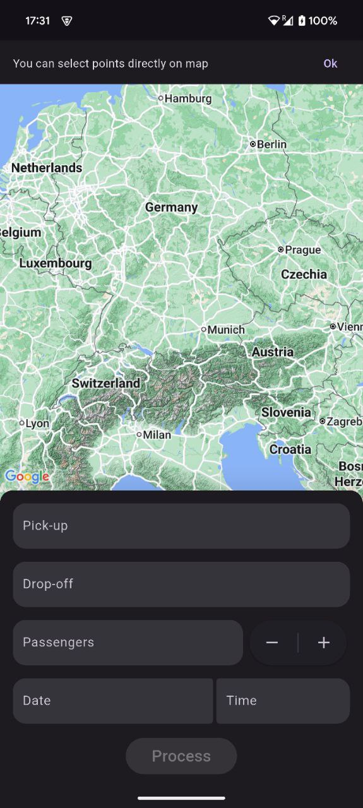
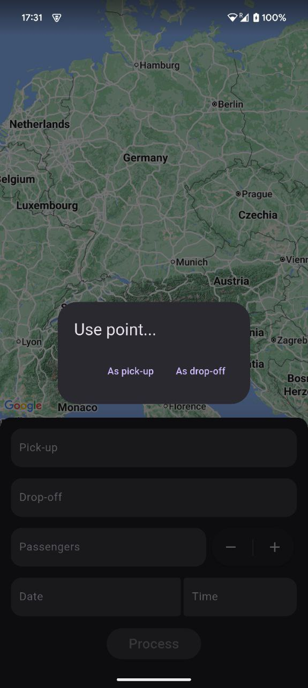
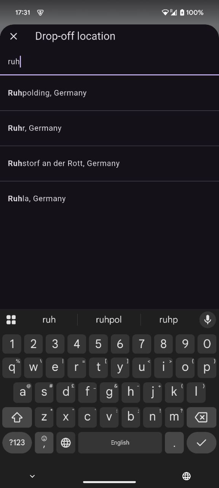
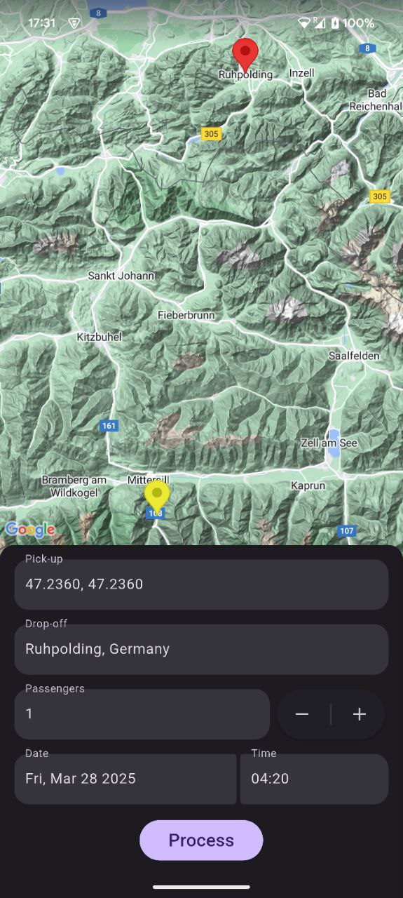

# ride_booking_app

Basic Ride Booking App

# How to run

1. Create `config/config.json` (use [config-template.json](config/config-template.json) as template)

2. Update values in [config/config.json](config/config.json):\
   `GOOGLE_MAPS_KEY` - Key for google map that works for android and ios
   `GOOGLE_MAPS_API_KEY` - Key for google map api - autocompletion, place details (can be same as `GOOGLE_MAPS_KEY`)

3. Add `--dart-define-from-file config/config.json` argument to any flutter runs.\
   Example: `flutter run --dart-define-from-file config/config.json`

# Video

# Screenshots

|  |  |  |  |
|:----------------------------:|:----------------------------:|:----------------------------:|:----------------------------:|
